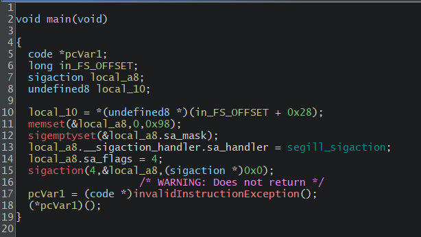
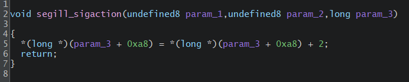
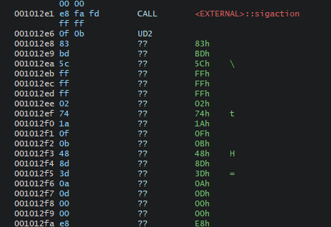
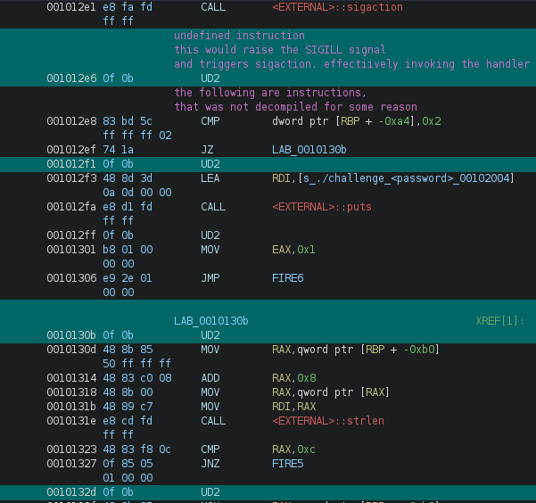
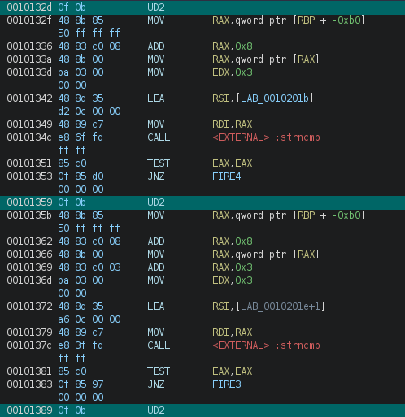
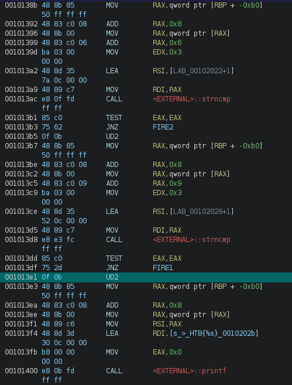
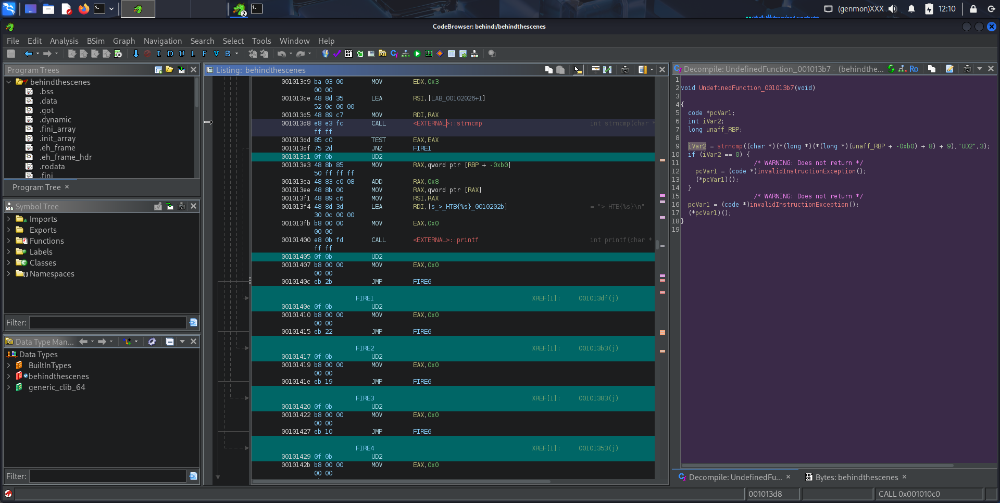
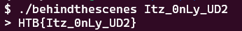

# Behind the Scenes

category: Reversing

## At a glance






- `void* memset(void* dest,int ch, size_t count);`
    - clears the information in `local_a8`
    - 0x98 = 152
- `int sigemptyset(sigset_t *set)`
    - it clears the specified thing

## sigaction

This is the construct specified in the manual:
```c
struct sigaction {
    void     (*sa_handler)(int);
    void     (*sa_sigaction)(int, siginfo_t *, void *);
    sigset_t   sa_mask;
    int        sa_flags;
    void     (*sa_restorer)(void);
};

int sigaction( // when SA_SIGINFO is set
    int signum,
    const struct sigaction *_Nullable restrict act,
    struct sigaction *_Nullable restrict oldact
);
```

The function [sigaction](https://www.man7.org/linux/man-pages/man2/sigaction.2.html) allows an function to be triggered when a specific signal is triggered. `sa_flags` simply lets you modify a signal handler behavior, in this case it's set to `4`, mapping to the macro in [signal](https://www.man7.org/linux/man-pages/man7/signal.7.html) is `SA_SIGINFO`.

When the `sa_flags` is set to `SA_SIGINFO`, the `sigaction` function takes three arguments: `signum`, `act`, and `oldact`. You can see it in the code block above.

From the sigaction(2) linux manual:
> The sigaction() system call is used to change the action taken by a process on receipt of a specific signal.  (See signal(7) for an overview of signals.)
> 
> `signum` specifies the signal and can be any valid signal except `SIGKILL` and `SIGSTOP`.
> 
> If act is non-NULL, the new action for signal signum is installed from act.  If oldact is non-NULL, the previous action is saved in oldact.

In the decompiled code `signum` is set to `4`, mapping to the macro is `SA_SIGILL`, and in [signal](https://www.man7.org/linux/man-pages/man7/signal.7.html) it means **Illegal instruction**.

## sigaction's action

We now know that what the trigger is, let's look at how the handler works. 

From the sigaction(2) linux manual:
> The siginfo_t argument to a SA_SIGINFO handler When the SA_SIGINFO flag is specified in act.sa_flags, the signal handler address is passed via the act.sa_sigaction field.  This handler takes three arguments, as follows:
> ```c
> void
> handler(int sig, siginfo_t *info, void *ucontext)
> {
>     ...
> }
> ```
> ...
> 
> **ucontext**
> This is a pointer to a ucontext_t structure, cast to void *.  The structure pointed to by this field contains signal context information that was saved on the user-space stack by the kernel; for details, see sigreturn(2).
> Further information about the ucontext_t structure can be found in getcontext(3) and signal(7).  Commonly, the handler function doesn't make any use of the third argument.

In the decompiled code it specifically uses the third argument, that is, `ucontext` *while I have yet to understand what it actual does*, but in hindsight, this has nothing to do with the flag.

## Illegal instruction

[UD — Undefined Instruction](https://www.felixcloutier.com/x86/ud) and it also has the spec for `UD2`, the illegal instruction in the challenge.

|Opcode|Instruction|Description|
|---|---|---|
|0F 0B|**UD2**|Raise invalid opcode exception|

This actually confuses the decompiler a lot, because in the first pass it stopped decompile the lines after `UD2` 



I found out the hexes are in fact, **instructions**, after trying dynamic analysis and finding out there are instructions at the address of these hexes

Since it's still technically instructions (opcodes), run decompile at these addresses turn them into human readable mnemonics.



## Code flow

`LAB_0010130b` and the other functions in the main function section are essentially `goto` jumps, and we can see the verification process that tells you to *enter a password* when you execute the ELF. It utilizes a `puts` function to print the string, when the input argument from the terminal is not equal to 2 using `CMP`. If the input argument is equal to 2, then it jumps to the section that first verify the length of the input using `strlen`, then compares the input string using `strcmp` by 3 bytes per section.

The code that checks if the user entered the correct number (which is 2) of arguments:
```assembly
CMP    dword ptr [RBP + -0xa4], 0x2
JZ     LAB_0010130b
UD2
LEA    RDI, [s_./challenge_<password>_00102004]
CALL   <EXTERNAL>::puts
```




And in the decompiled code, it translates the string that is compared for you:
```
iVar2 = strncmp(*(char **)(*(long *)(unaff_RBP + -0xb0) + 8),"Itz",3);

iVar2 = strncmp((char *)(*(long *)(*(long *)(unaff_RBP + -0xb0) + 8) + 3),"_0n",3);

iVar2 = strncmp((char *)(*(long *)(*(long *)(unaff_RBP + -0xb0) + 8) + 6),"Ly_",3);

iVar2 = strncmp((char *)(*(long *)(*(long *)(unaff_RBP + -0xb0) + 8) + 9),"UD2",3);
```

The full decompiled code for one of the sections of `strcmp` looks like this:



From `*(long *)(unaff_RBP + -0xb0) +8` in the `strcmp` code, we can tell this decompiled code correspond directly to the following instructions: `MOV    RAX, qword ptr [RBP + -0xb0]` and `ADD    RAX,0x8`. We can conclude that the input argument string is stored at this address, and we can see the same set of instructions in the "`printf`" section, so the string in the `printf` function that prints the flag is the input string we entered.

Code section that prints the flag:
```
MOV    RAX,qword ptr [RBP + -0xb0]
ADD    RAX,0x8
MOV    RAX,qword ptr [RAX]
MOV    RSI,RAX
LEA    RDI,[s_>_HTB{%s}_0010202b]
MOV    EAX,0x0
CALL   <EXTERNAL>::printf
```

So we can conclude that the password is `Itz_0nLy_UD2`, and executing the code with this argument verifies the answer.

