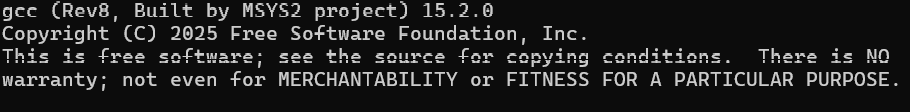
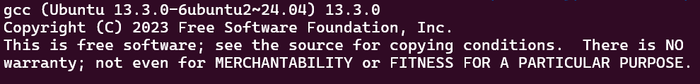

# Simple Encryptor

# Reproduce

1. go to your Linux machine (VM or WSL2)
2. issue `gcc -o solve solve.c` to your terminal
3. issue `./solve` and you would see the decrypted flag

# SRAND

First of all, there's this interesting thing where the `srand(seed)` and `rand()` behaves differently on Windows GCC and Linux GCC





So if you compiled it on a Windows machine and run it, you would've get a complete different set of random number generated by `rand()`. This took me quite awhile to figure out, so this is definitely worth mentioning.

# HOW

## Ghidra codebrowser

Ghidra is quite a powerful static analysis tool for all platforms, you just import the `encrypt` file into your project and have it decompile the ELF file for you.

## Decompiled Code

Another interesting thing.
```
(byte) flag[i] = (byte)flag[i] << (sbyte)rand2 | (byte)flag[i] >> 8 - (sbyte)rand2;
```

This decompiled C code is how the compiler implements the `ROL` (rotate left) instruction. This was not obvious to me at first glance, but it quickly became apparent after reading the assembly instruction line-by-line to make sure the decompiler didn't lie to me. (it didn't)

It essentially pulls the bits that should be rotated out down into range (8 - count) to be OR'd by the upper part that is left shifted. For rotate right it simple reverse the shift operator on both ends of the OR operator.

```
static uint8_t rotr8 (uint8_t n, unsigned int c){
   return (n >> c) | (n << (8 - c))
}
```

## FLAG.ENC file

This file contains the seed for `srand()` in the upper 4 bytes in little endian form. So `5a 35 b1 62` would convert to 0x62b1355a as the seed we will be using.

The lower 28 bytes are the ciphertext, also in little endian form. So the first byte would be in `flag[0]` the second byte would be in `flag[1]`, etc.

## Method

**Encryption**:
```
srand(seed)
for (i = 0; i < 28 ; i ++){
   rand1 ← rand()
   rand2 ← rand()
   flag[i] ← flag[i] ^ (rand1 & 0xff)
   flag[i] ← ROL8(flag[i], rand2 & 7)
}
enc ← flag
```

Because `a XOR b XOF b = a XOR 0 = a`, to reverse the XOR operation we just need to XOR it again. And rotate operation wouldn't lose any of the bits, so we won't need to brute-force any missing information.

**Decryption**:
```
srand(seed)
for (i = 0; i < 28 ; i ++){
    rand1 ← rand()
    rand2 ← rand()
    flag[i] ← ROR8(flag[i], rand2 & 7) ^ (rand1 & 0xff)
}
dec ← flag
```

Just like that it's done!

The only weird thing is the difference for `rand()` on Windows and Linux, other than that, this is a fairly simple challenge.